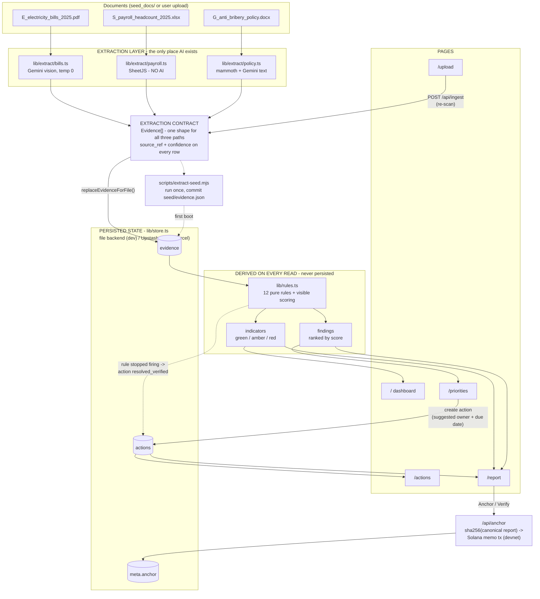
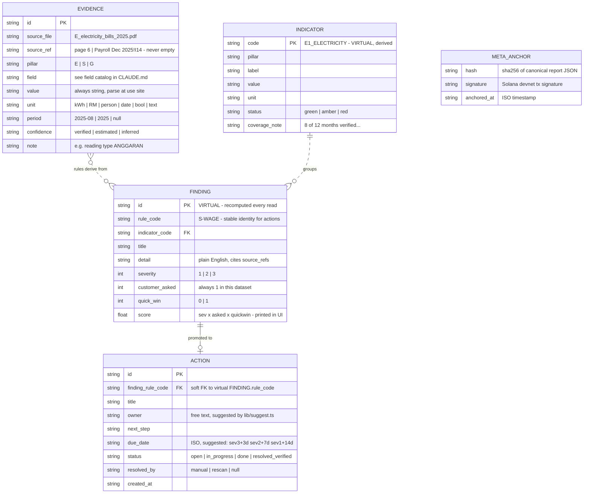
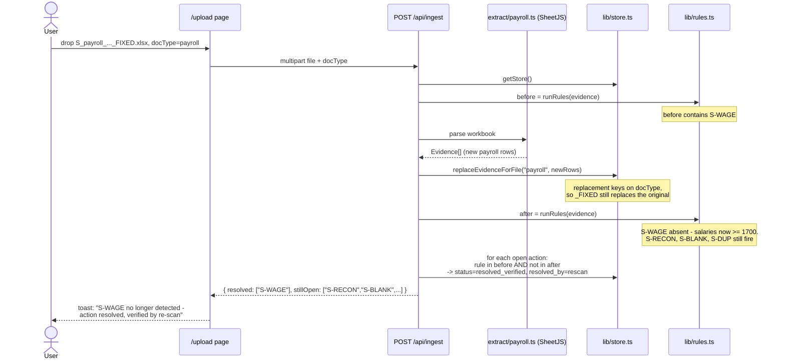

# ARCHITECTURE.md — ESG Evidence & Action Tool

Companion to CLAUDE.md. Read both before building. These diagrams are the
authoritative picture of the system: if code and diagram disagree, the diagram
plus CLAUDE.md win.

Three diagrams: (1) system architecture, (2) logical ERD, (3) the re-scan
auto-verify sequence. All Mermaid — GitHub renders them in the repo.

---

## 1. System architecture

Core principle made visual: **AI appears in exactly one layer** (extraction, left).
Everything to the right of the extraction contract is deterministic TypeScript.
Indicators and findings are derived on every read and never persisted — the store
holds only `evidence`, `actions`, and `meta.anchor`.

Reading notes for the builder:

- The **extraction contract** box is the interface everything hangs off. The three
  extractors and the rules engine can be built in parallel because both sides code
  against `Evidence[]`, never against each other.
- The **seed path** (dotted) means the app never depends on live AI to function:
  first boot loads `seed/evidence.json`; live extraction only happens via /upload.
- The dotted edge from rules to actions is the auto-verify: no user input, purely
  "the finding disappeared, therefore the action is verified resolved".
- `meta.anchor` is written only by /api/anchor and read only by /report.

---

## 2. Logical ERD

The store is a JSON blob (file or one Redis key), not SQL — but the logical model
is still relational and Claude Code must respect it. Solid entities persist;
`FINDING` and `INDICATOR` are **virtual** (recomputed by `runRules(evidence)` on
every read, never written anywhere). `ACTION.finding_rule_code` is a soft foreign
key into that virtual set — this is what makes auto-verify a set-diff instead of
a state-sync problem.

Integrity rules the code must enforce (there is no database to do it):

1. `EVIDENCE.source_ref` is never empty — a fact you cannot point back to is not
   evidence and must be rejected at ingest.
2. An `INDICATOR` is green only if every supporting `EVIDENCE` row has
   `confidence = verified` AND no finding touches it. One estimated row → amber.
3. `ACTION.finding_rule_code` must equal the `rule_code` of the finding it was
   created from; auto-verify depends on this key being stable across re-scans.
4. `FINDING` and `INDICATOR` are never written to the store. If you find yourself
   persisting them, you are building the staleness bug this design exists to avoid.

---

## 3. Re-scan auto-verify sequence (the demo centerpiece)

Deterministic end to end — the payroll path contains no AI, so this behaves
identically on every run.

The precision matters as much as the resolution: findings that still fire leave
their actions untouched. In the demo, exactly ONE action flips — that is the
proof the system checks data rather than optimism.

---

## 4. Deployment topology (one paragraph, no diagram needed)

One Next.js app on Vercel. API routes are the entire backend. Persistence is a
single Upstash Redis key in production (`STORAGE_BACKEND=redis`) because Vercel's
filesystem is read-only and lambdas don't share memory; locally it's
`data/store.json` (`STORAGE_BACKEND=file`). External calls: Gemini (extraction
only, seed-first), Solana devnet RPC (anchor/verify only, cached-signature
fallback). No other services exist.
